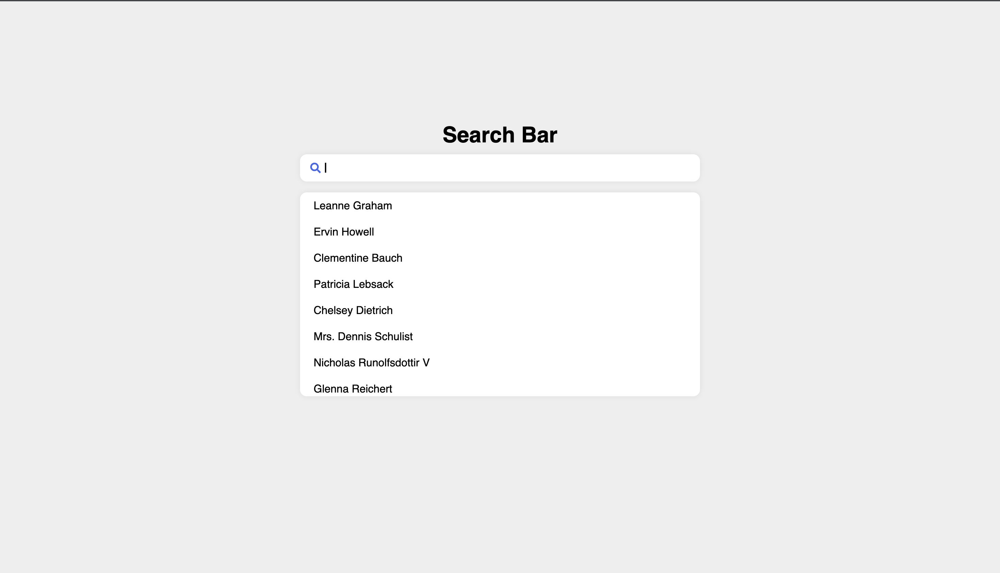

# React Search Bar

A Fun project let you search items from websites.

## Author

- [@Rock10578](https://github.com/Rock10578)


## Documentation

```Why you should use Vite?```

Vite serves source code over native ESM. This is essentially letting the browser take over part of the job of a bundler: Vite only needs to transform and serve source code on demand, as the browser requests it. Code behind conditional dynamic imports is only processed if actually used on the current screen.


### To create react and vite App
```
npm create vite@latest
framework: React
variant: JavaScript
```
## API Reference

#### Get items

```http
  https://jsonplaceholder.typicode.com/users
```

#### You can also visit
```http
  https://jsonplaceholder.typicode.com
```
to play with this api and create your app
## Color Reference

| Color             | Hex                                                                |
| ----------------- | ------------------------------------------------------------------ |
| Background (App)|  #eee |
| Background (Input) |  #ffffff |
| Box Shadow |  #ddd |
| Background (Results) |  #ffffff |
| Results Hover |  #eaeaea |


## Run Locally

Clone the project

```bash
  git clone https://github.com/Rock10578/Search_Bar_using_react.git
```

Go to the project directory

```bash
  cd react-search-bar
```

Install dependencies

```bash
  npm install
```

Start the server

```bash
  npm run dev
```


## Screenshots




## Contribution

Contributions are always welcome!
